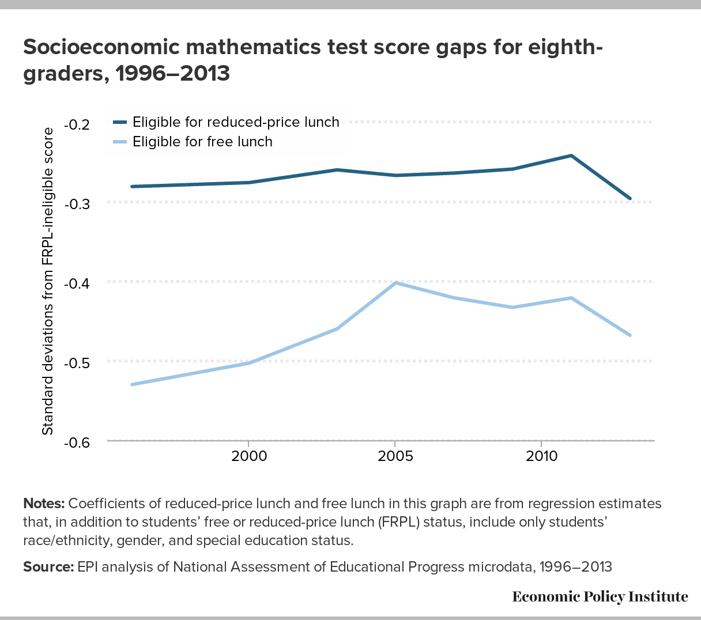

```{r setup, include=FALSE}
knitr::opts_chunk$set(echo = F, message = F, warning = F)
library(readr)
library(readxl)
library(dplyr)
library(tidyr)
library(ggplot2)
library(ggrepel)
library(ggpubr)
theme_set(theme_bw())
library(healthcareai)
library(kableExtra)

set.seed(1714)
```

```{r}
df <- read_csv("data/csvData.csv") |> 
  inner_join(
    read_excel("data/IDEExcelExport-Apr212022-0648PM.xls"),
    by = c("country" = "Jurisdiction")
    ) |> 
  inner_join(read_csv("data/API_NY.GDP.PCAP.CD_DS2_en_csv_v2_4019678.csv")) |> 
  inner_join(read_excel("data/tabn605.20.xls")) |> 
  inner_join(read_excel("data/tabn605.10.xls")) |> 
  select(-`...3`) |> 
  rename(gdp = `2020`) |> 
  mutate(across(-country, as.numeric))
```

Despesa total en educació:

```{r}
df |> 
  select(country, education_expenditure, `expenditure (gdp percentage)`) |> 
  arrange(desc(education_expenditure)) |> 
  kbl() |> 
  kable_paper("hover", full_width = F) |> 
  kable_styling(latex_options = "HOLD_position")
```

Ordenat segons percentatge PIB:

```{r}
df |> 
  select(country, education_expenditure, `expenditure (gdp percentage)`) |> 
  arrange(desc(`expenditure (gdp percentage)`)) |> 
  kbl() |> 
  kable_paper("hover", full_width = F) |> 
  kable_styling(latex_options = "HOLD_position")
```

Mirem si hi ha relació entre el que es gasten els països en educació i els seus resutats als tests estandaritzats:

```{r}
df |> 
  ggplot(aes(education_expenditure, Average, label = country)) + 
  geom_point() + 
  geom_text_repel(max.overlaps = 100) +
  geom_smooth(method = "lm") + 
  xlab("Despesa en educació") + 
  ylab("Nota mitdata PISA mates") +
  stat_cor(
    aes(label = ..r.label..),
    method = "spearman", 
    cor.coef.name = "r", 
    label.x = 15000,
    label.y = 410
    )
ggsave("plots/educationexpenditure_mathgrade.png")
```

Veiem que hi ha relació, amb un coeficient de correlació del 0.43, per tant una correlació moderada. Fixeu-vos però, que, justament Estats Units, destaca per tenir resultats força més baixos dels que els tocaria per despesa. 

A què es pot deure això? Aquí la intuïció del Marc crec que l'encerta de plè. Mirem els resulats d'USA per ètnia:


Aquí hi ha un efecte de l'ètnia ja conegut pel què fa als infants d'origen asiàtic, però, en la resta, el que pesa més és el nivell socioeconòmic (les persones de minories ètniques gairebé sempre són més pobres):


Per tant, veiem que un dels problemes principals és el rendiment de les persones més desafavorides. 

A EUA, com sabeu, hi ha molta desigualtat econòmica i cultural. Mirem com de gran és aquesta desigualtat i com afecta el rendiment acadèmic comparant totes les països:

```{r}
df |> 
  ggplot(aes(gini, Average, label = country)) + 
  geom_point() + 
  geom_text_repel(max.overlaps = 100) +
  geom_smooth(method = "lm") + 
  xlab("Índex de desigualtat") + 
  ylab("Nota mitdata PISA mates") +
  stat_cor(
    aes(label = ..r.label..),
    method = "spearman", 
    cor.coef.name = "r",
    label.x = 25, 
    label.y = 420
    )
ggsave("plots/unequality_mathgrade.png")

```

Mirem també el rendiment acadèmic segons el producte interior brut per càpita:

```{r}
df |> 
  ggplot(aes(gdp, Average, label = country)) + 
  geom_point() + 
  geom_text_repel(max.overlaps = 100) +
  geom_smooth(method = "lm") + 
  xlab("PIB per càpita") + 
  ylab("Nota mitdata PISA mates") +
  stat_cor(
    aes(label = ..r.label..),
    method = "spearman", 
    cor.coef.name = "r",
    label.x = 70000, 
    label.y = 420
    )
ggsave("plots/gdp_mathgrade.png")
```

La correlació és força menor. 

Ho mirarem ara segons despesa pública i privada:

```{r}
dfa <- read_csv("data/DP_LIVE_13052022093559460.csv") |> 
  select(LOCATION, edu_priv_exp = Value, TIME) |> 
  inner_join(
    read_csv("data/DP_LIVE_13052022093641444.csv") |> 
      select(LOCATION, edu_pub_exp = Value, TIME)
  ) |> 
  inner_join(
    read_csv("data/DP_LIVE_13052022094023663.csv") |> 
      select(LOCATION, gini = Value, TIME)
  ) |> 
  inner_join(
    read_csv("data/Countries abbreviations - Full 1.csv") |> 
      select(name, `alpha-3`),
    by = c("LOCATION" = "alpha-3")
  ) |> 
  rename(country = name) |> 
  filter(TIME == "2018") |> 
  mutate(
    country = gsub(" of Great Britain and Northern Ireland", "", gsub(" of America", "", country))
  )
```

```{r}
dft <- df |> 
  select(-gini) |> 
  inner_join(dfa)
```

```{r}
dft |> 
  ggplot(aes(edu_priv_exp, Average, label = country)) + 
  geom_point() + 
  geom_text_repel(max.overlaps = 100) +
  geom_smooth(method = "lm") + 
  xlab("Despesa en educació privada (% PIB)") + 
  ylab("Nota mitdata PISA mates") +
  stat_cor(
    aes(label = ..r.label..),
    method = "spearman", 
    cor.coef.name = "r",
    label.x = 0.25, 
    label.y = 420
    )
ggsave("plots/priv_edu_mathgrade.png")
```

```{r}
dft |> 
  ggplot(aes(edu_pub_exp, Average, label = country)) + 
  geom_point() + 
  geom_text_repel(max.overlaps = 100) +
  geom_smooth(method = "lm") + 
  xlab("Despesa en educació pública (% PIB)") + 
  ylab("Nota mitdata PISA mates") +
  stat_cor(
    aes(label = ..r.label..),
    method = "spearman", 
    cor.coef.name = "r",
    label.x = 5.5, 
    label.y = 420
    )
ggsave("plots/pub_edu_mathgrade.png")
```

Despesa privada i gini:

```{r}
dft |> 
  ggplot(aes(edu_priv_exp, gini, label = country)) + 
  geom_point() + 
  geom_text_repel(max.overlaps = 100) +
  geom_smooth(method = "lm") + 
  xlab("Despesa en educació privada (% PIB)") + 
  ylab("Desigualtat") +
  stat_cor(
    aes(label = ..r.label..),
    method = "spearman", 
    cor.coef.name = "r",
    label.x = 1.7, 
    label.y = 0.27
    )
ggsave("plots/pub_priv_gini.png")
```

Despesa pública i gini:

```{r}
dft |> 
  ggplot(aes(edu_pub_exp, gini, label = country)) + 
  geom_point() + 
  geom_text_repel(max.overlaps = 100) +
  geom_smooth(method = "lm") + 
  xlab("Despesa en educació pública (% PIB)") + 
  ylab("Desigualtat") +
  stat_cor(
    aes(label = ..r.label..),
    method = "spearman", 
    cor.coef.name = "r",
    label.x = 5.5, 
    label.y = 0.4
    )
ggsave("plots/pub_edu_gini.png")
```

## Evolucions

```{r}
col_mex <- "#E06666"
col_nor <- "#4B39B5"
col_usa <- "#F6B26B"
countries <- c("Mexico", "Norway", "United States")
read_csv("data/API_SI.POV.GINI_DS2_en_csv_v2_4021396.csv") |> 
  filter(`Country Name` %in% countries) |> 
  select(-c(`Country Code`, `Indicator Name`, `Indicator Code`, X67)) |> 
  pivot_longer(-`Country Name`, names_to = "year") |> 
  mutate(across(c(year, value), as.numeric)) |> 
  drop_na() |> 
  ggplot(aes(x = year, y = value, group = `Country Name`, colour = `Country Name`)) + 
  geom_line(size = 1.5) +
  theme(axis.text.x = element_text(angle = 45, hjust=1)) + 
  xlab("") + 
  ylab("Índex Gini") + 
  scale_colour_manual(values = c(col_mex, col_nor, col_usa)) +
  guides(colour=guide_legend(title="")) +
  annotate("label", x = 2020, y = 48, label = "45.4", colour = col_mex) +
  annotate("label", x = 2019, y = 43, label = "41.5", colour = col_usa) +
  annotate("label", x = 2019, y = 29.5, label = "27.7", colour = col_nor)
ggsave("plots/gini_evolution.png")
```

```{r}
read_csv("data/API_FP.CPI.TOTL.ZG_DS2_en_csv_v2_4020861.csv") |> 
  filter(`Country Name` %in% countries)  |> 
  select(-c(`Country Code`, `Indicator Name`, `Indicator Code`, X67)) |> 
  pivot_longer(-`Country Name`, names_to = "year") |> 
  mutate(value = as.character(value)) |> 
    bind_rows(
    c(`Country Name` = "Mexico", year = 2022, value = 7.9),
    c(`Country Name` = "Norway", year = 2022, value = 5.4),
    c(`Country Name` = "United States", year = 2022, value = 8.3)
  ) |>
  mutate(across(c(year, value), as.numeric)) |> 
  filter(year > 2014) |> 
  ggplot(aes(x = as.factor(year), y = value, group = `Country Name`, colour = `Country Name`)) + 
  geom_line(size = 1.5) +
  theme(axis.text.x = element_text(angle = 45, hjust=1)) + 
  xlab("") + 
  ylab("Inflació (%)") + 
  scale_colour_manual(values = c(col_mex, col_nor, col_usa)) +
  guides(colour=guide_legend(title=""))
 ggsave("plots/inflation.png")
```

## Models

Mirem quina de les tres variables (PIB per càpita, despesa en educació o índex de desigualtat) afecta més al rendiment acadèmic segons PISA:

```{r}
cus_scale <- function(x) (x - mean(x, na.rm = T)) / sd(x, na.rm = T)
dfs <- df |> 
  mutate(across(-country, cus_scale))
```

```{r}
ml <- machine_learn(
  dfs |> select(
    inequality = gini, 
    math_score = Average,
    education_expenditure,
    gdp
    ),
  outcome = math_score,
  allow_parallel = T
)
ml
```

Podem explicar un 74% de la variabilitat de la nota mitdata en mates només amb aquestes tres variables. Això és moltíssim! Mirem quines són més importants:

Segons models de Random Forest:

```{r}
ml |> 
  get_variable_importance() |> 
  plot()
```

Segons la regressió:

```{r}
ml |> 
  interpret() |> 
  plot()
```

Molt interessant! La desigualtat és el factor més important, i per això USA té resultats baixos, però que compensa **una mica** gastant-se molts diners (i, per això, en el gràfic de índex de desigualtat vs nota mitdata, surten per sobre de la línia blava).

